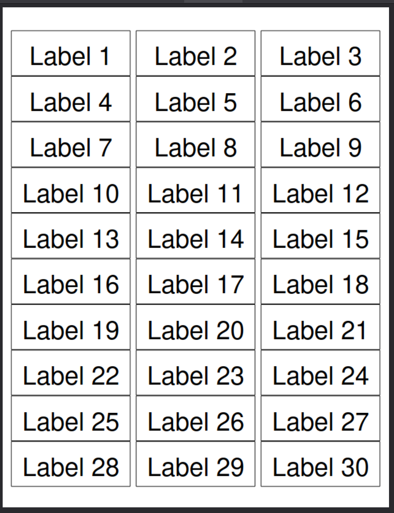
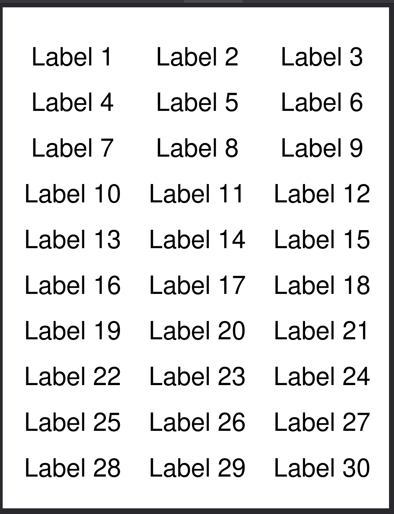

# FBA 3x10 letter-size label printer



## Installing
### Ubuntu
```bash
sudo apt install php-cli
```

## Running
```bash
php -S 127.0.0.1:8000
```

## Label Paper Stock
- 3 x 10 labels on letter-size
- Each label measures 66mm x 25mm

## Contributing
This command tells Git to assume that the specified file has not changed, even if it has. This can be useful for temporarily ignoring changes to a file without modifying .gitignore.

```bash
git update-index --assume-unchanged <file>
```

This command reverses the effect of --assume-unchanged, telling Git to resume tracking changes to the specified file.
```bash
git update-index --no-assume-unchanged <file>
```