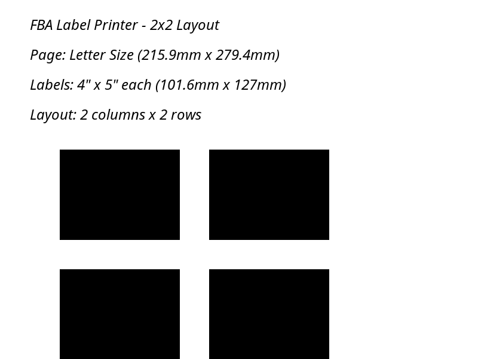
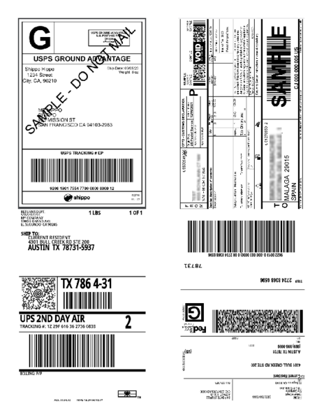
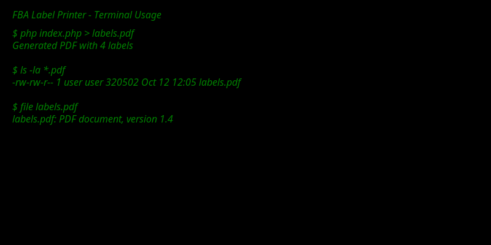

# Shipping Label Printer

A PHP-based label printing system for shipping labels. This tool generates PDF labels with automatic image processing and positioning for 2x2 label layouts on letter-size paper.

## Screenshots

### Label Layout Diagram


### Generated Label Output


### Terminal Usage


### Sample Output
The application generates PDF labels with your configured images positioned in the 2x2 layout.

## Features

- **2x2 Label Layout**: Prints 4 labels per page (2 columns × 2 rows) on letter-size paper
- **Automatic Image Processing**: Intelligently rotates and scales images to fit label dimensions
- **Multi-Image Support**: Configure up to 4 different images for each label position
- **Smart Positioning**: Images are automatically centered and scaled to preserve aspect ratio
- **Image Validation**: Validates image files before processing
- **Error Handling**: Graceful error handling with visual feedback for invalid images

## Label Specifications

- **Page Size**: Letter (215.9mm × 279.4mm)
- **Label Dimensions**: 4" × 5" (101.6mm × 127mm each)
- **Layout**: 2 columns × 2 rows = 4 labels total
- **Margins**: 4mm left, 12mm top/bottom
- **Column Spacing**: 4.5mm between columns

## Requirements

- PHP 7.0 or higher
- ImageMagick (for image rotation)
- FPDF library (included)

## Installation

### Ubuntu/Debian
```bash
# Install PHP CLI
sudo apt install php-cli

# Install ImageMagick
sudo apt install imagemagick

# Clone the repository
git clone <repository-url>
cd php-fba-label-printer
```

### Other Systems
Ensure you have PHP CLI and ImageMagick installed on your system.

## Usage

### Basic Usage
```bash
# Start the development server
php -S 127.0.0.1:8000

# Open in browser
# Navigate to http://127.0.0.1:8000
```

### Command Line Usage
```bash
# Generate PDF directly
php index.php > labels.pdf

# View the generated PDF
evince labels.pdf
```

### Configuration

Edit the `$images` array in `index.php` to specify which images to use for each label position:

```php
$images = [
    'top-left' => 'sample.png',      // Top-left label
    'top-right' => 'sample2.png',    // Top-right label  
    'bottom-left' => 'sample3.png', // Bottom-left label
    'bottom-right' => 'sample4.png' // Bottom-right label
];
```

### Supported Image Formats
- JPEG (.jpg, .jpeg)
- PNG (.png)
- GIF (.gif)

## How It Works

1. **Image Validation**: Checks if image files exist and are in supported formats
2. **Smart Processing**: Analyzes image dimensions and determines optimal orientation
3. **Automatic Rotation**: Rotates images 90° if it provides better fit
4. **Scaling & Centering**: Scales images to fit label dimensions while preserving aspect ratio
5. **PDF Generation**: Creates PDF with properly positioned images using FPDF

## File Structure

```
php-fba-label-printer/
├── index.php              # Main application file
├── lib/                   # FPDF library and fonts
│   ├── fpdf.php          # FPDF core library
│   ├── font/             # Font files
│   └── ...
├── sample.png            # Sample images
├── sample2.png
├── sample3.png
├── sample4.png
└── README.md
```

## Error Handling

The system provides visual feedback for various error conditions:
- **File not found**: Shows "File not found" message
- **Invalid format**: Shows "Invalid image format" message  
- **Unsupported type**: Shows "Unsupported image type" message
- **Processing error**: Shows "PROCESSING ERROR" message

## Contributing

### Git Commands for Development

To temporarily ignore changes to a file during development:
```bash
git update-index --assume-unchanged <file>
```

To resume tracking changes:
```bash
git update-index --no-assume-unchanged <file>
```

## License

This project is open source. Please check the license file for details.

## Troubleshooting

### Common Issues

1. **ImageMagick not found**: Ensure ImageMagick is installed and accessible from command line
2. **Permission errors**: Check file permissions for image files
3. **Memory issues**: For large images, consider resizing before processing

### Debug Mode

To enable debug output, modify the error reporting in `index.php`:
```php
error_reporting(E_ALL);
ini_set('display_errors', 1);
```